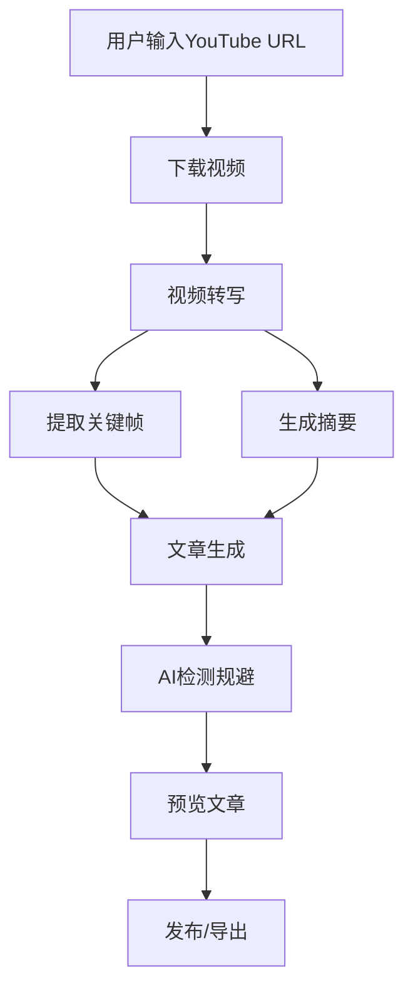
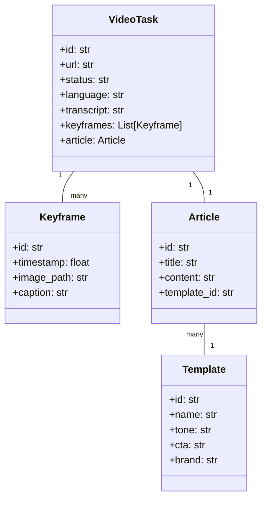

# YT-Article Craft 架构设计文档

## 1. 项目概述

YT-Article Craft是一款基于Python与PyQt6界面的桌面应用，它自动将YouTube视频转写、提炼要点、截取关键画面并生成符合Medium写作风格的图文并茂文章，同时通过AI-Evasion模块让内容顺利通过AI检测。

### 1.1 核心功能

- 视频智能转写：调用whisper/ASR模型自动生成逐句文稿
- 关键帧提取：抓取情绪峰值/主题转换处的画面
- Medium风格段落生成：输出痛点导入、故事化叙述、简洁小标题的段落
- AI检测规避：重写与人类化语气微调
- 一键发布草稿：直接推送到Medium/WordPress
- 多语言翻译：支持中/英等多语言
- 项目模板库：保存常用的品牌口吻、CTA、配色方案

## 2. 技术选型

- **编程语言**：Python 3.9+
- **UI框架**：PyQt6
- **数据库**：SQLite
- **视频处理**：yt-dlp, OpenCV, SceneDetect
- **AI模型**：OpenAI API (GPT-4o), Whisper
- **发布集成**：Medium API, WordPress API
- **多语言支持**：DeepL API

## 3. 系统架构

YT-Article Craft采用MVC（模型-视图-控制器）架构模式，并包含插件系统以支持未来扩展。

### 3.1 架构图

```
+------------------+     +------------------+     +------------------+
|      Models      |<--->|   Controllers   |<--->|      Views       |
+------------------+     +------------------+     +------------------+
        ^                        ^                        ^
        |                        |                        |
        v                        v                        v
+------------------+     +------------------+     +------------------+
|    Database      |     |    Services     |     |     Widgets      |
+------------------+     +------------------+     +------------------+
                                 ^
                                 |
                                 v
                         +------------------+
                         |  Plugin System   |
                         +------------------+
```

### 3.2 层次结构

1. **模型层（Models）**：负责数据的存储、检索和处理
2. **视图层（Views）**：负责用户界面的呈现和用户交互
3. **控制器层（Controllers）**：负责连接模型和视图，处理业务逻辑
4. **服务层（Services）**：提供核心功能实现，如视频处理、AI交互等
5. **数据库层（Database）**：负责数据的持久化存储
6. **插件系统（Plugin System）**：提供扩展机制，允许第三方开发者扩展应用功能

## 4. 项目结构

```
yt_article_craft/
│
├── main.py                  # 应用程序入口点
├── requirements.txt         # 依赖项列表
├── setup.py                 # 安装脚本
├── README.md                # 项目说明文档
│
├── app/                     # 应用核心
│   ├── __init__.py
│   ├── config.py            # 应用配置
│   └── constants.py         # 常量定义
│
├── models/                  # 数据模型 (M in MVC)
│   ├── __init__.py
│   ├── video_task.py        # VideoTask 模型
│   ├── template.py          # Template 模型
│   └── database.py          # 数据库管理
│
├── views/                   # 用户界面 (V in MVC)
│   ├── __init__.py
│   ├── main_window.py       # 主窗口
│   ├── task_dock.py         # 任务面板
│   ├── editor_pane.py       # 编辑面板
│   ├── preview_pane.py      # 预览面板
│   ├── dialogs/             # 对话框
│   └── widgets/             # 自定义控件
│
├── controllers/             # 控制器 (C in MVC)
│   ├── __init__.py
│   ├── app_controller.py    # 应用控制器
│   ├── task_controller.py   # 任务控制器
│   └── template_controller.py # 模板控制器
│
├── services/                # 服务层
│   ├── __init__.py
│   ├── transcriber.py       # 视频转写服务
│   ├── summarizer.py        # 摘要生成服务
│   ├── keyframe.py          # 关键帧提取服务
│   ├── ai_bypass.py         # AI检测规避服务
│   ├── translator.py        # 多语言翻译服务
│   └── publisher.py         # 发布服务
│
├── utils/                   # 工具函数
│   ├── __init__.py
│   ├── youtube_dl.py        # YouTube下载工具
│   ├── file_utils.py        # 文件操作工具
│   └── text_utils.py        # 文本处理工具
│
├── resources/               # 资源文件
│   ├── styles/              # 样式表
│   ├── icons/               # 图标
│   └── templates/           # 模板文件
│
├── plugins/                 # 插件系统
│   ├── __init__.py
│   ├── plugin_manager.py    # 插件管理器
│   ├── plugin_interface.py  # 插件接口定义
│   └── builtin/             # 内置插件
│
└── tests/                   # 测试
    ├── __init__.py
    ├── test_models.py
    ├── test_services.py
    └── test_controllers.py
```

## 5. 核心模块设计

### 5.1 模型层

#### 5.1.1 VideoTask 模型

VideoTask模型表示一个视频处理任务，包含视频URL、转写文本、关键帧、生成的文章等信息。

主要属性：
- id: 任务ID
- url: YouTube视频URL
- status: 任务状态（等待执行、下载中、转写中、提取关键帧中、生成文章中、已完成、失败）
- language: 语言代码
- title: 视频标题
- description: 视频描述
- transcript: 转写文本
- keyframes: 关键帧列表
- article: 生成的文章
- template_id: 使用的模板ID
- created_at: 创建时间
- updated_at: 更新时间
- metadata: 元数据

#### 5.1.2 Template 模型

Template模型表示文章模板，包含风格、CTA、品牌语调等信息。

主要属性：
- id: 模板ID
- name: 模板名称
- tone: 语气风格（专业、轻松、故事化等）
- cta: Call to Action
- brand: 品牌语调
- structure: 文章结构
- css: 自定义CSS
- created_at: 创建时间
- updated_at: 更新时间

#### 5.1.3 数据库管理

DatabaseManager负责数据的持久化存储，提供CRUD接口。

主要功能：
- 初始化数据库
- 创建、读取、更新、删除视频任务
- 创建、读取、更新、删除模板
- 数据备份和恢复

### 5.2 视图层

#### 5.2.1 主窗口

MainWindow是应用程序的主窗口，包含菜单栏、工具栏和三个主要面板。

主要功能：
- 创建菜单和工具栏
- 管理三个主要面板（任务面板、编辑面板、预览面板）
- 处理用户交互

#### 5.2.2 任务面板

TaskDock是左侧任务列表面板，显示所有任务。

主要功能：
- 显示任务列表
- 创建新任务
- 选择任务

#### 5.2.3 编辑面板

EditorPane是中间编辑区面板，用于编辑文章内容。

主要功能：
- 编辑文章内容
- 插入关键帧
- 格式化文本

#### 5.2.4 预览面板

PreviewPane是右侧预览面板，实时预览文章效果。

主要功能：
- 预览文章效果
- 切换预览模式（Medium、WordPress等）

### 5.3 控制器层

#### 5.3.1 应用控制器

AppController是应用程序的主控制器，负责协调各个组件。

主要功能：
- 初始化应用程序
- 连接模型和视图
- 处理全局事件

#### 5.3.2 任务控制器

TaskController负责任务的创建、更新、删除等操作。

主要功能：
- 创建新任务
- 加载任务
- 更新任务状态
- 删除任务

#### 5.3.3 模板控制器

TemplateController负责模板的管理。

主要功能：
- 创建新模板
- 加载模板
- 更新模板
- 删除模板

### 5.4 服务层

#### 5.4.1 视频转写服务

TranscriberService负责将视频转写为文本。

主要功能：
- 加载Whisper模型
- 转写音频
- 分段转写

#### 5.4.2 摘要生成服务

SummarizerService负责生成文章摘要。

主要功能：
- 调用OpenAI API
- 生成摘要
- 生成Medium风格段落

#### 5.4.3 关键帧提取服务

KeyframeService负责提取视频关键帧。

主要功能：
- 使用OpenCV和SceneDetect提取关键帧
- 分析视频场景变化
- 提取情绪峰值画面

#### 5.4.4 AI检测规避服务

AIBypassService负责规避AI检测。

主要功能：
- 重写文本
- 人类化语气微调
- 混合风格

#### 5.4.5 多语言翻译服务

TranslatorService负责多语言翻译。

主要功能：
- 调用DeepL API
- 翻译文章
- 本地校正

#### 5.4.6 发布服务

PublisherService负责发布文章。

主要功能：
- 发布到Medium
- 发布到WordPress
- 导出Markdown/PDF

### 5.5 插件系统

插件系统允许第三方开发者扩展应用功能。

主要组件：
- PluginInterface: 插件接口
- PluginManager: 插件管理器
- 内置插件

## 6. 数据流设计

### 6.1 视频处理流程



### 6.2 数据模型关系



## 7. 开发规范

### 7.1 代码风格

- 保持代码风格一致
- 关键功能和API需要有清晰的文档
- 使用类型提示
- 遵循PEP 8规范

### 7.2 文档规范

关键功能和API需要有清晰的文档：

```python
def process_video(url: str, options: dict = None) -> VideoTask:
    """处理YouTube视频，生成转写文本和关键帧
    
    Args:
        url: YouTube视频URL
        options: 处理选项，可包含语言、质量等设置
        
    Returns:
        VideoTask: 包含处理结果的任务对象
        
    Raises:
        ValueError: 如果URL无效
        ConnectionError: 如果无法连接到YouTube
    """
    # 实现代码
```

### 7.3 错误处理

使用异常机制处理错误，并提供有意义的错误信息：

```python
try:
    result = service.process(data)
except ServiceError as e:
    logging.error(f"处理失败: {e}")
    show_error_dialog(f"处理失败: {e}")
```

### 7.4 测试策略

1. **单元测试**：测试各个组件的独立功能
2. **集成测试**：测试组件之间的交互
3. **UI测试**：测试用户界面的功能和响应
4. **性能测试**：测试在不同负载下的性能
5. **用户测试**：收集真实用户的反馈

## 8. 开发路线图

按照PRD中的开发路线图，建议以下实施顺序：

1. **MVP v0.1**：
   - 实现基本UI框架
   - 实现YouTube下载功能
   - 实现转写功能
   - 实现简单摘要生成
   - 实现Markdown导出

2. **v0.2**：
   - 实现关键帧提取
   - 实现图文混排编辑器
   - 实现Medium模板

3. **v0.3**：
   - 实现AI检测规避模块
   - 实现多语言翻译
   - 实现草稿发布API

4. **v1.0**：
   - 实现模板库管理
   - 实现品牌色与字体配置
   - 实现批量任务队列

5. **v2.0**：
   - 实现团队协作（云同步）
   - 实现细粒度权限
   - 实现插件市场
