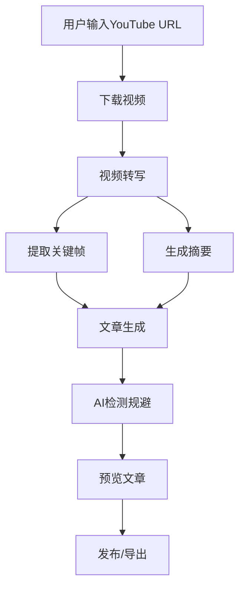
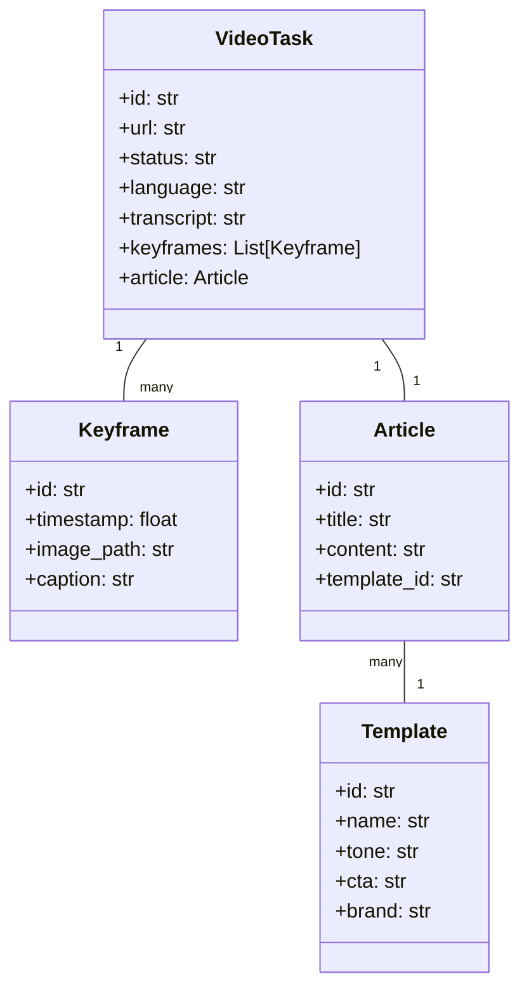

# YT-Article Craft 总体设计文档

## 1. 项目概述

YT-Article Craft是一款基于Python与PyQt6界面的桌面应用，它自动将YouTube视频转写、提炼要点、截取关键画面并生成符合Medium写作风格的图文并茂文章，同时通过AI-Evasion模块让内容顺利通过AI检测。

### 1.1 目标用户

- 想快速沉淀视频内容的**内容创作者/博主**
- 需要高效率内容再利用的**品牌营销人员**
- 追求SEO流量的**独立站运营者**

### 1.2 核心功能

- 视频智能转写：调用whisper/ASR模型自动生成逐句文稿
- 关键帧提取：抓取情绪峰值/主题转换处的画面
- Medium风格段落生成：输出痛点导入、故事化叙述、简洁小标题的段落
- AI检测规避：重写与人类化语气微调
- 一键发布草稿：直接推送到Medium/WordPress
- 多语言翻译：支持中/英等多语言
- 项目模板库：保存常用的品牌口吻、CTA、配色方案

## 2. 系统架构概览

YT-Article Craft采用MVC（模型-视图-控制器）架构模式，并包含插件系统以支持未来扩展。系统由以下几个主要部分组成：

1. **UI层**：基于PyQt6的用户界面，包括主窗口、任务面板、编辑器和预览面板
2. **服务层**：核心功能实现，包括视频转写、关键帧提取、文章生成等
3. **数据层**：数据存储和管理，包括SQLite数据库和本地文件缓存
4. **插件系统**：提供扩展机制，允许第三方开发者扩展应用功能

### 2.1 架构图

```
+------------------+     +------------------+     +------------------+
|      Models      |<--->|   Controllers   |<--->|      Views       |
+------------------+     +------------------+     +------------------+
        ^                        ^                        ^
        |                        |                        |
        v                        v                        v
+------------------+     +------------------+     +------------------+
|    Database      |     |    Services     |     |     Widgets      |
+------------------+     +------------------+     +------------------+
                                 ^
                                 |
                                 v
                         +------------------+
                         |  Plugin System   |
                         +------------------+
```

### 2.2 技术选型

- **编程语言**：Python 3.9+
- **UI框架**：PyQt6
- **数据库**：SQLite
- **视频处理**：yt-dlp, OpenCV, SceneDetect
- **AI模型**：OpenAI API (GPT-4o), Whisper
- **发布集成**：Medium API, WordPress API
- **多语言支持**：DeepL API

## 3. 核心模块设计

### 3.1 异步任务系统

异步任务系统是YT-Article Craft的核心组件之一，它负责处理耗时操作，如视频下载、转写、关键帧提取等，同时保持UI的响应性。

#### 3.1.1 主要组件

- **Task**：任务基类，定义任务的基本接口
- **TaskManager**：任务管理器，负责创建、调度和管理任务
- **Worker**：工作线程，负责执行任务
- **TaskQueue**：任务队列，管理待执行的任务

#### 3.1.2 工作流程

1. 用户创建任务（如处理视频）
2. TaskManager创建Task实例并提交到线程池
3. Worker在后台线程中执行任务
4. 任务通过信号机制向UI报告进度和状态
5. 任务完成后，结果通过信号返回给UI

详细设计请参考[异步任务系统设计文档](async_task_system.md)。

### 3.2 插件系统

插件系统允许第三方开发者扩展应用功能，而无需修改核心代码。

#### 3.2.1 主要组件

- **PluginInterface**：插件接口，定义插件的基本行为
- **PluginManager**：插件管理器，负责加载、管理和卸载插件
- **Hook**：钩子机制，允许插件在特定事件发生时执行自定义代码

#### 3.2.2 钩子类型

- 应用钩子：与应用程序生命周期相关
- 任务钩子：与视频任务相关
- UI钩子：与用户界面相关
- 服务钩子：与服务相关

详细设计请参考[插件系统设计文档](plugin_system.md)。

### 3.3 数据模型

#### 3.3.1 VideoTask

VideoTask模型表示一个视频处理任务，包含视频URL、转写文本、关键帧、生成的文章等信息。

主要属性：
- id: 任务ID
- url: YouTube视频URL
- status: 任务状态
- language: 语言代码
- transcript: 转写文本
- keyframes: 关键帧列表
- article: 生成的文章

#### 3.3.2 Template

Template模型表示文章模板，包含风格、CTA、品牌语调等信息。

主要属性：
- id: 模板ID
- name: 模板名称
- tone: 语气风格
- cta: Call to Action
- brand: 品牌语调
- structure: 文章结构

### 3.4 服务层

服务层提供核心功能实现，每个服务都是独立的模块。

- **TranscriberService**：使用Whisper模型进行视频转写
- **SummarizerService**：使用OpenAI API生成摘要和重写内容
- **KeyframeService**：使用OpenCV和SceneDetect提取关键帧
- **AIBypassService**：实现AI检测规避功能
- **TranslatorService**：提供多语言翻译功能
- **PublisherService**：实现Medium/WordPress发布功能

### 3.5 用户界面

用户界面采用三栏布局：

- **左侧**：任务列表面板（TaskDock）
- **中间**：编辑区面板（EditorPane）
- **右侧**：预览面板（PreviewPane）

## 4. 数据流设计

### 4.1 视频处理流程



### 4.2 数据模型关系



## 5. 项目结构

```
yt_article_craft/
│
├── main.py                  # 应用程序入口点
├── requirements.txt         # 依赖项列表
├── setup.py                 # 安装脚本
├── README.md                # 项目说明文档
│
├── app/                     # 应用核心
│   ├── __init__.py
│   ├── config.py            # 应用配置
│   └── constants.py         # 常量定义
│
├── models/                  # 数据模型 (M in MVC)
│   ├── __init__.py
│   ├── video_task.py        # VideoTask 模型
│   ├── template.py          # Template 模型
│   └── database.py          # 数据库管理
│
├── views/                   # 用户界面 (V in MVC)
│   ├── __init__.py
│   ├── main_window.py       # 主窗口
│   ├── task_dock.py         # 任务面板
│   ├── editor_pane.py       # 编辑面板
│   ├── preview_pane.py      # 预览面板
│   ├── dialogs/             # 对话框
│   └── widgets/             # 自定义控件
│
├── controllers/             # 控制器 (C in MVC)
│   ├── __init__.py
│   ├── app_controller.py    # 应用控制器
│   ├── task_controller.py   # 任务控制器
│   └── template_controller.py # 模板控制器
│
├── services/                # 服务层
│   ├── __init__.py
│   ├── transcriber.py       # 视频转写服务
│   ├── summarizer.py        # 摘要生成服务
│   ├── keyframe.py          # 关键帧提取服务
│   ├── ai_bypass.py         # AI检测规避服务
│   ├── translator.py        # 多语言翻译服务
│   └── publisher.py         # 发布服务
│
├── utils/                   # 工具函数
│   ├── __init__.py
│   ├── youtube_dl.py        # YouTube下载工具
│   ├── file_utils.py        # 文件操作工具
│   └── text_utils.py        # 文本处理工具
│
├── resources/               # 资源文件
│   ├── styles/              # 样式表
│   ├── icons/               # 图标
│   └── templates/           # 模板文件
│
├── plugins/                 # 插件系统
│   ├── __init__.py
│   ├── plugin_manager.py    # 插件管理器
│   ├── plugin_interface.py  # 插件接口定义
│   └── builtin/             # 内置插件
│
└── tests/                   # 测试
    ├── __init__.py
    ├── test_models.py
    ├── test_services.py
    └── test_controllers.py
```

## 6. 开发规范

### 6.1 代码风格

- 保持代码风格一致
- 关键功能和API需要有清晰的文档
- 使用类型提示
- 遵循PEP 8规范

### 6.2 文档规范

关键功能和API需要有清晰的文档：

```python
def process_video(url: str, options: dict = None) -> VideoTask:
    """处理YouTube视频，生成转写文本和关键帧
    
    Args:
        url: YouTube视频URL
        options: 处理选项，可包含语言、质量等设置
        
    Returns:
        VideoTask: 包含处理结果的任务对象
        
    Raises:
        ValueError: 如果URL无效
        ConnectionError: 如果无法连接到YouTube
    """
    # 实现代码
```

### 6.3 错误处理

使用异常机制处理错误，并提供有意义的错误信息：

```python
try:
    result = service.process(data)
except ServiceError as e:
    logging.error(f"处理失败: {e}")
    show_error_dialog(f"处理失败: {e}")
```

## 7. 开发路线图

按照PRD中的开发路线图，建议以下实施顺序：

1. **MVP v0.1**：
   - 实现基本UI框架
   - 实现YouTube下载功能
   - 实现转写功能
   - 实现简单摘要生成
   - 实现Markdown导出

2. **v0.2**：
   - 实现关键帧提取
   - 实现图文混排编辑器
   - 实现Medium模板

3. **v0.3**：
   - 实现AI检测规避模块
   - 实现多语言翻译
   - 实现草稿发布API

4. **v1.0**：
   - 实现模板库管理
   - 实现品牌色与字体配置
   - 实现批量任务队列

5. **v2.0**：
   - 实现团队协作（云同步）
   - 实现细粒度权限
   - 实现插件市场

## 8. 总结

YT-Article Craft是一个功能强大的视频内容转换工具，它采用MVC架构模式，结合异步任务系统和插件系统，提供了一个灵活、可扩展的应用框架。通过组件化开发和模块化设计，确保了代码的可复用性、可扩展性和可维护性。

详细设计文档：
- [架构设计文档](architecture.md)
- [异步任务系统设计文档](async_task_system.md)
- [插件系统设计文档](plugin_system.md)